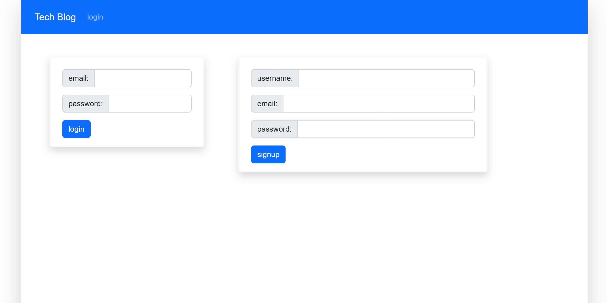
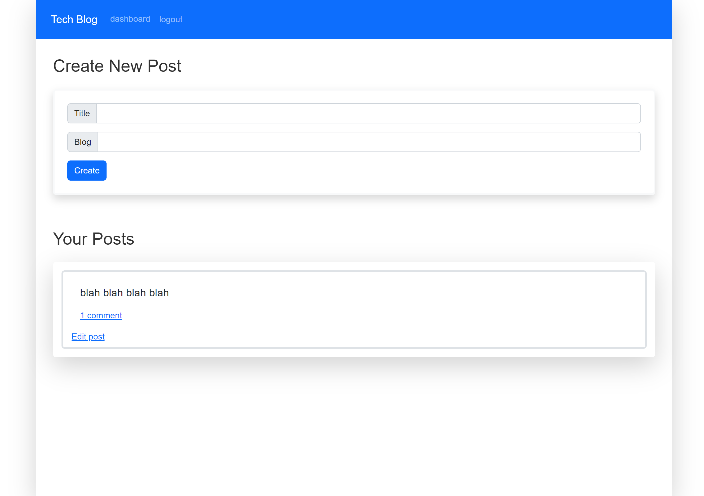
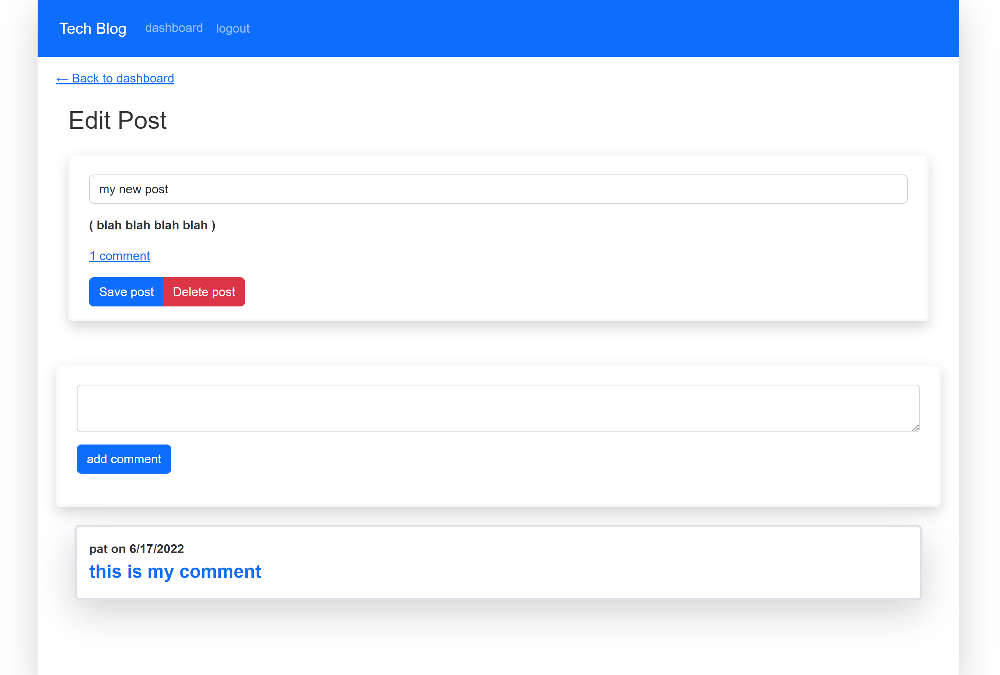

# 14 Model View Controller (MVC): Tech Blog

Writing about tech can be just as important as making it. Developers spend plenty of time creating new applications and debugging existing codebases, but most developers also spend at least some of their time reading and writing about technical concepts, recent advancements, and new technologies. A simple Google search for any concept covered in this course returns thousands of think pieces and tutorials from developers of all skill levels!

&nbsp;

## Description

This is a CMS-style blog site similar to a Wordpress site, where developers can publish their blog posts and comment on other developers’ posts as well.  This app follows the MVC paradigm in its architectural structure, uses Handlebars.js as the templating language, Sequelize as the ORM, and the express-session npm package for authentication.

&nbsp;

---
## User Story

AS A developer who writes about tech
I WANT a CMS-style blog site
SO THAT I can publish articles, blog posts, and my thoughts and opinions

&nbsp;

---
## Usage

* Simply click on the Deployed Heroku APP link to get started.
* Click on login in the navbar.
* You will need to sign up first, which will give you access to add your own posts and comments.

&nbsp;

---
## Links

[GitHub Repository](https://github.com/MorningSol/tech-blog)

[Deployed Heroku APP](https://guarded-everglades-71696.herokuapp.com/)

&nbsp;

---
## Application Demonstration

&nbsp;

